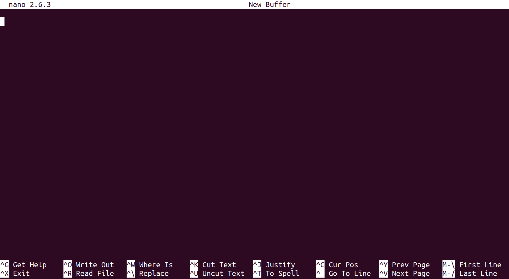

# Differential Expression Analysis: From basics to pipeline
This tutorial will walk you through the theory and praxis of running a 
differential expression analyses on unix (linux/mac) systems. It will start
by giving you a brief refresher on basic bash commands (for more complete
tutorial on bash basics, please see [here](
https://jshleap.github.io/programming/writing-jBasic_BASH/)), moving towards the
usage of [genpipes](https://genpipes.readthedocs.io/en/genpipes-v3.1.5/), a
popular HPC pipeline for multiple genomic analyses. I will explain the theory
behind each of the steps, as well as explain the options of some software to be
used. 
Here I will be focusing on the use in [Compute Canada](
https://docs.computecanada.ca/wiki/Getting_started) systems, but should be easily
extendable to other kinds of HPC systems (particularly if they use SLURM as a 
scheduler).


Table of Contents
=================

* [Intro](#intro) 
  * [Unix generalities](#unix-generalities)
  * [Principles of RNA-seq](#principles-of-rna-seq)
  * [RNA-seq standard analysis](#rna-seq-standard-analysis)

* [Quality control check with FASTQC](#quality-control-check-with-fastqc)
  * [Working with FASTQC](#working-with-fastqc)
  * [Understanding the report](#understanding-the-report)
  * [Generating a report for your files](#generating-a-report-for-your-files)
<!---
* [Trimming and adapter removal with Trimmomatic](#trimming-and-adapter-removal-with-trimmomatic)
  * [Introduction to Trimmomatic](#introduction-to-trimmomatic)
  * [Understanding Trimmomatic options](#understanding-trimmomatic-options)
  * [Working with Trimmomatic](#working-with-trimmomatic)
  * [Trimming your reads](#trimming-your-reads)

* [Alignment and junction discovery using STAR](#alignment-and-junction-discovery-using-star)
  * [Understanding STAR options: Generating indices](#understanding-star-options-generating-indices)
  * [Understanding STAR options: Mapping](#understanding-star-options-mapping)
  * [Working with STAR](#working-with-star)
  * [Generating your indices and your mapping](#Generating your indices and your mapping)

* [Cleaning the alignment with Picard](#cleaning-the-alignment-with-picard)
  * [Introduction to picard (only the relevant parts as this is a very big tool)](#introduction-to-picard-only-the-relevant-parts-as-this-is-a-very-big-tool)
  * [Understanding picard’s markduplicates](#understanding-picards-markduplicates)
  * [Understanding picard’s RNA metrics](#understanding-picards-rna-metrics)
  * [Cleaning your data and generate metrics](#cleaning-your-data-and-generate-metrics)

Post-alignment quality control (30 mins)
Introduction to RNASeQC
Understanding RNASeQC options
Generating a report for your files (assignment)

Transcript assembly with Cufflinks (2 - 3 Hours)
Introduction to transcriptome assembly
Understanding Samtools hardclip
Understanding Cufflinks 
Understanding Cuffmerge
Understanding Cuffdiff
Understanding Cuffnorm
Running Cufflink bundle on your data (Assignment)

Differential expression analysis using DESeq2 (1 hour)
Differential expression analysis
Understanding R
Understanding the R package DESeq2
Doing DE analysis on your data (Assignment)

Putting all together and more: GenPIPEs (1 - 1.5 hours)
Understanding genpipes
Using GenPIPES on compute canada
Running GenPIPEs on your data (Assignment)
-->

## Intro
### Unix generalities
This tutorial expect you to be more or less comfortable in the terminal. Let's just
touch up on a few things:
#### Connecting to a remote server
On unix-like systems we can use the secure shell command `ssh` to connect to a 
remote server. In the terminal we can:
```bash
ssh username@remotehost
```
username being your username in the remote host and remote host the IP or name 
of the remote server. For example, let's say that you have an account in the
[Graham](https://docs.computecanada.ca/wiki/Graham) cluster under the username
someuser, you could connect to graham through a unix terminal:
```bash
ssh someuser@graham.computecanada.ca
```
This will connect you to one of the Compute Canada HPC called Graham. For Windows
users without the [linux subsystem](https://docs.microsoft.com/en-us/windows/wsl/about),
I recommend the applicatio [MobaXterm](https://mobaxterm.mobatek.net/) that allows
you to connect to remote servers and move files between your local computer and
a cluster for example. Similar to the example above, you need toc create an ssh
session:


#### Moving files from and to a remote server
There are multiples ways to copy files from and to a remote server. One useful 
one is the rsync command, which allows you to also move only files and folder that
are not up to date in the destination. In unix like systems the general command
is:

```bash
rsync source destination
```

To better understand this, let's assume that in our local computer (i.e. your 
laptop) you have a file called `afile.txt` in the path `/home/someuser/test`. 
Let's say that you want to move it to Graham supercomputer. You can so this by:

```bash
rsync /home/someuser/test/afile.txt someuser@graham.computecanada.ca
```

This will put afile.txt in Graham's `/home/someuser`. Now let's say that you want
to put it in a different location, say that you have a folder within you home (
`/home/someuser`) called `testing`. You can do:

```bash
rsync /home/someuser/test/afile.txt someuser@graham.computecanada.ca:/home/someuser/testing
```

In MobaXterm, you have a sidebar for sftp where you can drag and drop your files:


#### Creating folders, files, and moving around a unix server
Just a brief mention of how you can create a folder and move around a unix system.
Say you just connected to the cluster (i.e. Graham) and want to create a folder
in your home call test. You can do this by:

```bash
mkdir test
```

Now you have created test in `/home/someuser` (which is the home of `someuser`), 
now to move into that folder we can use the change directory command `cd`:

```bash
cd /home/someuser/test
```

You can check your current path with the command `pwd`. Paths can be absolute (
it gives you the full path from `/` to where you are), or relative to where you
are. For example, to get back to your home `/home/someuser`, you could:

```bash
cd /home/someuser
```

as an absolute path or:

```bash
cd ..
```

relative to the working directory that you were in `/home/someuser/test`.

Your home also has a special character to refer to without using an absolute path
with is the tilde (`~`). No matter where you are, you can always refer to you home
bu `~`. For example to move to the test folder you created earlier you can do:

```bash
cd ~/test
```

Now, let's say that instead of a folder, you want to create a file within the test
folder (where we are). You can create the file in your own computer and move it as
explained in [Moving files from and to a remote server](#moving-files-from-and-to-a-remote-server)
or you can use the editors available in the cluster (i.e. nano, vin, emacs). To
use nano, you simply type `nano` in the terminal, and a blank space will show up:



#### Downloading files from the web
There are many unix commands to download files from the web. Two of the most
popular are [curl](https://github.com/curl/curl) and [wget](
https://www.gnu.org/software/wget/). I'll focus on the latter. Wget allows you
to get content from the web. **If the content is not a file, it will download the
full html page** so beware of that. For this tutorial let's download a file that 
we will use later on, located at this url: 
https://www.sharcnet.ca/~jshleap/tips_n_tricks/right.norm.fq. In your computer, 
you can just click on the link and will start downloading, but if you want it to 
download it directly on the terminal (or in a server's terminal), you can use 
`wget` as:

```bash
wget https://www.sharcnet.ca/~jshleap/tips_n_tricks/right.norm.fq
```

That will start the download of this fastqfile. Wget has a lot of options that
can be seen using the manual:

```bash
man wget
```
but their explanation is out of the scope of this tutorial.


##### Filesystem structure in Compute Canada
***If you are not using Compute Canada, you might skip this intermission.***

Most of Compute Canada resources (i.e. Graham, Beluga and Cedar) have 3 filesystem
spaces:
1. Home: Is a limited space where configuration files (like .bashrc) are stored
2. Project: This is a Lustre filesystem with bigger space (depends on the type 
   of account) and is permanent (not erased)
3. Scratch: Also a Lustre Filesystem with 20Tb of volatile space (gets purge 
   every 60 days). Is intended for computation and storage of intermediate files
   during a run
   
### Submitting jobs with SLURM scheduler
Compute Canada systems (along with many other HPC systems) have a [SLURM](
https://slurm.schedmd.com/documentation.html) scheduler. This is required since
HPC systems are clusters of interconnected computers and with many users a queue
is required to keep the system running smoothly. The heavy computation happens
in the compute nodes, and the instructions on how to run the job have to be sent
through SLURM commands such as `sbatch`. This command takes a batch script as 
input, which contains SBTACH directives along with your program's execution.
Let's say that you normally run a program called `myprogram`, and it takes a file
called `afile.txt` as input. Perhaps you can run this program in your own computer 
with 4 cpus like:

```bash
myprogram -t 4 afile.txt
```

`-t` being the option for the number of cpus to use. Let's say that you'd like to
use this program in a HPC system using 32 cpus. Let's say that you know that with
the input `afile.txt` and those 32 cpus, you will be using 100Mb of memory, and
it will take roughly 2 hours. Then, in a nano window, you should write something
like this:

```bash
#!/bin/bash                       
#SBATCH --account=def-someuser  #<-- this is the account of the PI
#SBATCH --time=0-2:00:00        #<-- you need to provide the expected time (dd-hh:mm-ss)
#SBATCH --cpus-per-task=32      #<-- Here is where you put the number of cpus you want
#SBATCH --mem=0                 #<-- Amount of memory. In this case reserve all memory
myprogram -t 32 afile.txt       #<-- Your command goes after the directives
```
After that, you can exit nano by pressing the key `ctrl` and `X`. Nano will ask
if you'd like to save the modified file, and will ask you to name the file. Let's
assume we named it `submit.sh`. Now we have a submission script ready, and we 
can proceed for the submission using sbatch:

```bash
sbatch submit.sh
```

You might be thinking, why `--mem=0`? This is because **in Compute Canada** most
nodes have around 125Gb of RAM, and is more efficient to reserve a full node than 
part of one (easier to schedule). So by asking for 32 CPUS (most Graham's nodes
have 32 cpus) and `mem=0` and  `--cpus-per-task=32` we reserved a full node in
this cluster. You will need to know the node characteristics of your systems to
tune this.

Another thing to point our is that the program `myprogram` needs to be on path
for this execution to work. Most HPC systems have a very vast software stack, and
you will have to get familiar with it. Compute Canada uses the [LMOD](
https://lmod.readthedocs.io/en/latest/) system to load programs as modules. It 
has a convenient search command called `module spider`. So let's say that instead
of `myprogram` you would like to run [fastqc](
https://www.bioinformatics.babraham.ac.uk/projects/fastqc/), then your `submit.sh`
script should be changed to include the loading of fastqc. In Compute Canada systems:

```bash
module spider fastqc
```
will render:
```angular2html
---------------------------------------------------------------------------------------------------------------------------
  fastqc:
---------------------------------------------------------------------------------------------------------------------------
    Description:
      FastQC is a quality control application for high throughput sequence data. It reads in sequence data in a variety of
      formats and can either provide an interactive application to review the results of several different QC checks, or
      create an HTML based report which can be integrated into a pipeline.

     Versions:
        fastqc/0.11.5
        fastqc/0.11.8
        fastqc/0.11.9

---------------------------------------------------------------------------------------------------------------------------
  For detailed information about a specific "fastqc" package (including how to load the modules) use the module's full name.
  Note that names that have a trailing (E) are extensions provided by other modules.
  For example:

     $ module spider fastqc/0.11.9
---------------------------------------------------------------------------------------------------------------------------
```

Which means that there are 3 different versions of the program. To see an specific 
version you can:

```bash
module spider fastqc/0.11.9
```

rendering:
```angular2html
---------------------------------------------------------------------------------------------------------------------------
  fastqc: fastqc/0.11.9
---------------------------------------------------------------------------------------------------------------------------
    Description:
      FastQC is a quality control application for high throughput sequence data. It reads in sequence data in a variety of
      formats and can either provide an interactive application to review the results of several different QC checks, or
      create an HTML based report which can be integrated into a pipeline.

    Properties:
      Bioinformatic libraries/apps / Logiciels de bioinformatique

    You will need to load all module(s) on any one of the lines below before the "fastqc/0.11.9" module is available to load.

      StdEnv/2020
      nixpkgs/16.09
 
    Help:
      
      Description
      ===========
      FastQC is a quality control application for high throughput
      sequence data. It reads in sequence data in a variety of formats and can either
      provide an interactive application to review the results of several different
      QC checks, or create an HTML based report which can be integrated into a
      pipeline.
      
      
      More information
      ================
       - Homepage: https://www.bioinformatics.babraham.ac.uk/projects/fastqc/
      


```

There it says that you need to load ***EITHER*** `StdEnv/2020` ***OR*** 
`nixpkgs/16.09` before you can load `fastqc/0.11.9`. Now, we can try to load it:

```bash
module load StdEnv/2020 fastqc/0.11.9
```

To see what is loaded you can use the command `module list`, which will render:
```
Currently Loaded Modules:
  1) CCconfig             4) imkl/2020.1.217  (math)   7) libfabric/1.10.1      10) java/13.0.2   (t)
  2) gentoo/2020    (S)   5) intel/2020.1.217 (t)      8) openmpi/4.0.3    (m)  11) fastqc/0.11.9 (bio)
  3) gcccore/.9.3.0 (H)   6) ucx/1.8.0                 9) StdEnv/2020      (S)

  Where:
   S:     Module is Sticky, requires --force to unload or purge
   bio:   Bioinformatic libraries/apps / Logiciels de bioinformatique
   m:     MPI implementations / Implémentations MPI
   math:  Mathematical libraries / Bibliothèques mathématiques
   t:     Tools for development / Outils de développement
   H:                Hidden Module
```

Now that we know how to load it, let's add it to our submission script. Let's 
say that we want to process the fastq file that we downloaded earlier. Then our
new submission script will become:

```
#!/bin/bash                       
#SBATCH --account=def-someuser  #<-- this is the account of the PI
#SBATCH --time=0-0:05:00        #<-- you need to provide the expected time (dd-hh:mm-ss)
#SBATCH --cpus-per-task=1       #<-- Here is where you put the number of cpus you want
#SBATCH --mem=4G                #<-- Amount of memory. In this case reserve all memory

module load StdEnv/2020 fastqc/0.11.9
fastq  ~/test/right.norm.fq     
```
In this case the program (`fastq`) does not require too much memory (hence the 
`mem=4G`) and time (hence the 5 minutes).

#### Checking your job status with SLURM
Slurm has a command to tell you how busy the cluster is, and what is the status
of your job, is called `squeue`. If you cast squeue without any options it will
list all users that have submitted a job. However, you can narrow the search to
yourself by passing your username with the `-u` option. For example, if your
username is `someuser`, you can do:

```bash
squeue -u someuser
```
A more real example would be my own. I have started an interactive job (yes 
there is a way) with my username `jshleap` and my own group `def-jshleap`, then:

```bash
squeue -u jshleap
```

renders:

```
          JOBID     USER              ACCOUNT           NAME  ST  TIME_LEFT NODES CPUS TRES_PER_N MIN_MEM NODELIST (REASON) 
       44129014  jshleap      def-jshleap_cpu             sh   R      59:45     1    1        N/A    256M gra796 (None) 
```

Which gives you the jobid (the ID of the launched job) the user, the account used
the name you gave to the job (it defaults to the same of your submit script), 
the status (`st`), the requested resources (time, nodes, cpus, other resources, 
memory), the name of the nodes (if running), and the reason why it hasn't started 
(if it hasn't). The status can be Running (R), pending (PD), and clearing (C).

#### Getting an interactive shell
Oftentimes you want to test or run a job that is shorter or that is not very 
resource intensive. For those cases is better to ask for a interactive shell. 
An interactive shell is basically an allocation of a compute node that you can 
access interactively. To schedule an interactive shell with SLURM, you can use
the `salloc` command. You will need to pass the account through the option `--accoun`
or `-A` for short. So in the example above, I would do either:

```bash
salloc -A def-jshleap
```

or 

```bash
salloc --account=def-jshleap
```

This will schedule an interactive job on the `def-jshleap` account with the
default memory (250Mb for Compute Canada clusters), one cpu in one node, and
one hour. The same sbatch directive we passed to in the `submit.sh` file can be
passed to the `salloc` command to modify the request. For example, if we wanted
8 cpus, 10Gb of memory, and two hours of computation, we can request an 
interactive shell like this:

```bash
salloc -A def-jshleap --mem=10G --cpus-per-task=8 --time=00-02:00:00
```

#### SLURM environmental variables
Unix systems already have a lot environmental variables that can be useful, you
can check a non-comprehensive list [here](https://www.guru99.com/linux-environment-variables.html).
Likewise, inside an slurm job there is a series of environmental variables that
you can use in your script:
* SLURM_CPUS_PER_TASK: Number of cpus requested per task. Only set if the 
  `--cpus-per-task` option is specified. This can be useful to assign threads
  to your programs, so you do not have to change the value in multiple parts of
  the script.
* SLURM_JOB_NAME: Name of the job. Can be useful for input/output names
* SLURM_MEM_PER_NODE: Same as `--mem`. Useful to assign maximum memory. It does
  not work when `mem` has been assigned to 0.
* SLURM_TMPDIR: Path to a local temporary directory. Usually is a SSD, which 
  makes IO much faster. However, is volatile  
  


For a more comprehensive list, check the slurm manual [here](https://slurm.schedmd.com/sbatch.html).

### Principles of RNA-seq
### RNA-seq standard analysis