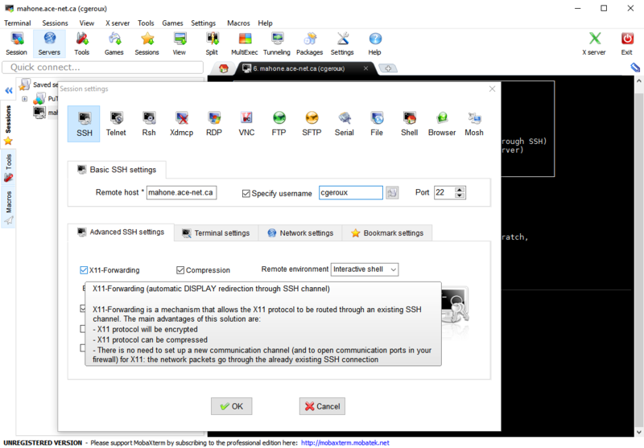

# Differential Expression Analysis: From basics to pipeline
This tutorial will walk you through the theory and praxis of running a 
differential expression analyses on unix (linux/mac) systems. It will start
by giving you a brief refresher on basic bash commands (for more complete
tutorial on bash basics, please see [here](
https://jshleap.github.io/programming/writing-jBasic_BASH/)), moving towards the
usage of [genpipes](https://genpipes.readthedocs.io/en/genpipes-v3.1.5/), a
popular HPC pipeline for multiple genomic analyses. I will explain the theory
behind each of the steps, as well as explain the options of some software to be
used. 
Here I will be focusing on the use in [Compute Canada](
https://docs.computecanada.ca/wiki/Getting_started) systems, but should be easily
extendable to other kinds of HPC systems (particularly if they use SLURM as a 
scheduler).


Table of Contents
=================

* [Intro](#intro) 
  * [Unix generalities](#unix-generalities)
  * [Principles of RNA-seq](#principles-of-rna-seq)
  * [RNA-seq standard analysis](#rna-seq-standard-analysis)

* [Quality control check with FASTQC](#quality-control-check-with-fastqc)
  * [Working with FASTQC](#working-with-fastqc)
  * [Understanding the report](#understanding-the-report)
  * [Generating a report for your files](#generating-a-report-for-your-files)
<!---
* [Trimming and adapter removal with Trimmomatic](#trimming-and-adapter-removal-with-trimmomatic)
  * [Introduction to Trimmomatic](#introduction-to-trimmomatic)
  * [Understanding Trimmomatic options](#understanding-trimmomatic-options)
  * [Working with Trimmomatic](#working-with-trimmomatic)
  * [Trimming your reads](#trimming-your-reads)

* [Alignment and junction discovery using STAR](#alignment-and-junction-discovery-using-star)
  * [Understanding STAR options: Generating indices](#understanding-star-options-generating-indices)
  * [Understanding STAR options: Mapping](#understanding-star-options-mapping)
  * [Working with STAR](#working-with-star)
  * [Generating your indices and your mapping](#Generating your indices and your mapping)

* [Cleaning the alignment with Picard](#cleaning-the-alignment-with-picard)
  * [Introduction to picard (only the relevant parts as this is a very big tool)](#introduction-to-picard-only-the-relevant-parts-as-this-is-a-very-big-tool)
  * [Understanding picard’s markduplicates](#understanding-picards-markduplicates)
  * [Understanding picard’s RNA metrics](#understanding-picards-rna-metrics)
  * [Cleaning your data and generate metrics](#cleaning-your-data-and-generate-metrics)

Post-alignment quality control (30 mins)
Introduction to RNASeQC
Understanding RNASeQC options
Generating a report for your files (assignment)

Transcript assembly with Cufflinks (2 - 3 Hours)
Introduction to transcriptome assembly
Understanding Samtools hardclip
Understanding Cufflinks 
Understanding Cuffmerge
Understanding Cuffdiff
Understanding Cuffnorm
Running Cufflink bundle on your data (Assignment)

Differential expression analysis using DESeq2 (1 hour)
Differential expression analysis
Understanding R
Understanding the R package DESeq2
Doing DE analysis on your data (Assignment)

Putting all together and more: GenPIPEs (1 - 1.5 hours)
Understanding genpipes
Using GenPIPES on compute canada
Running GenPIPEs on your data (Assignment)
-->

## Intro
### Unix generalities
This tutorial expect you to be more or less comfortable in the terminal. Let's just
touch up on a few things:
#### Connecting to a remote server
On unix-like systems we can use the secure shell command `ssh` to connect to a 
remote server. In the terminal we can:
```bash
ssh username@remotehost
```
username being your username in the remote host and remote host the IP or name 
of the remote server. For example, let's say that you have an account in the
[Graham](https://docs.computecanada.ca/wiki/Graham) cluster under the username
someuser, you could connect to graham through a unix terminal:
```bash
ssh someuser@graham.computecanada.ca
```
This will connect you to one of the Compute Canada HPC called Graham. For Windows
users without the [linux subsystem](https://docs.microsoft.com/en-us/windows/wsl/about),
I recommend the applicatio [MobaXterm](https://mobaxterm.mobatek.net/) that allows
you to connect to remote servers and move files between your local computer and
a cluster for example. Similar to the example above, you need toc create an ssh
session:



### Principles of RNA-seq
### RNA-seq standard analysis